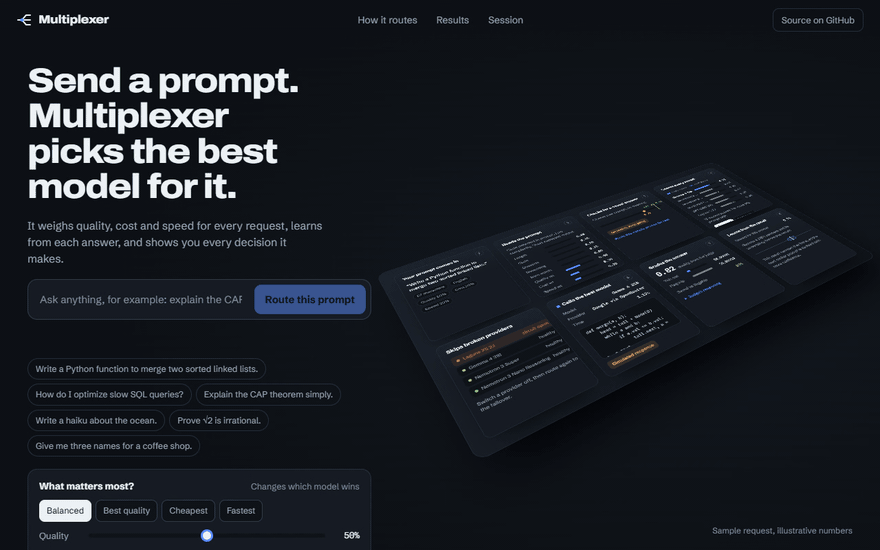
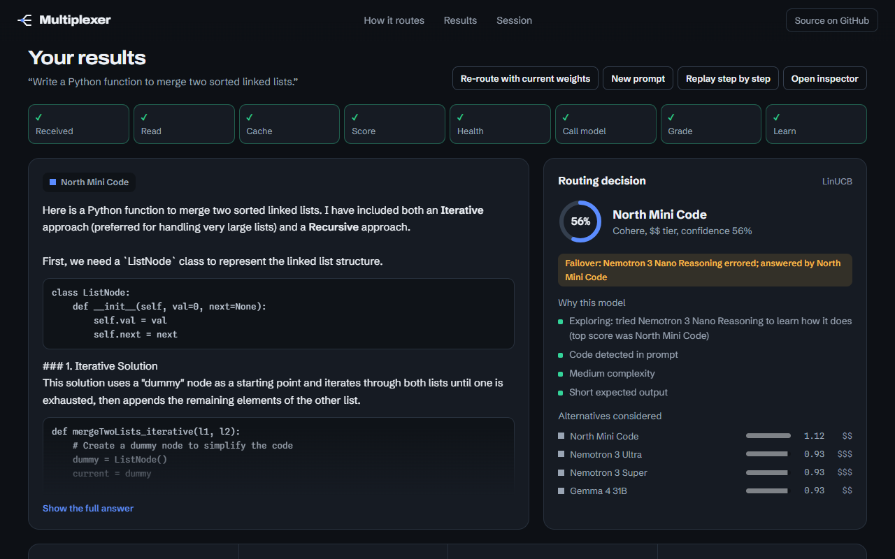
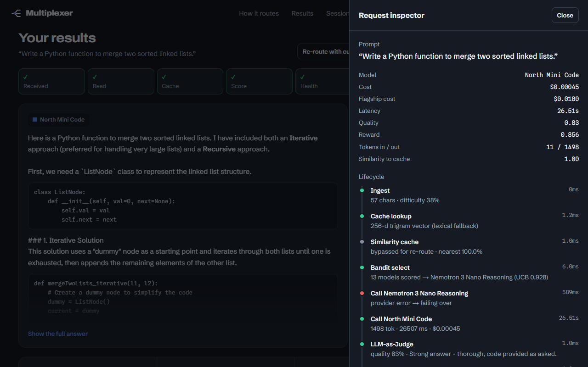
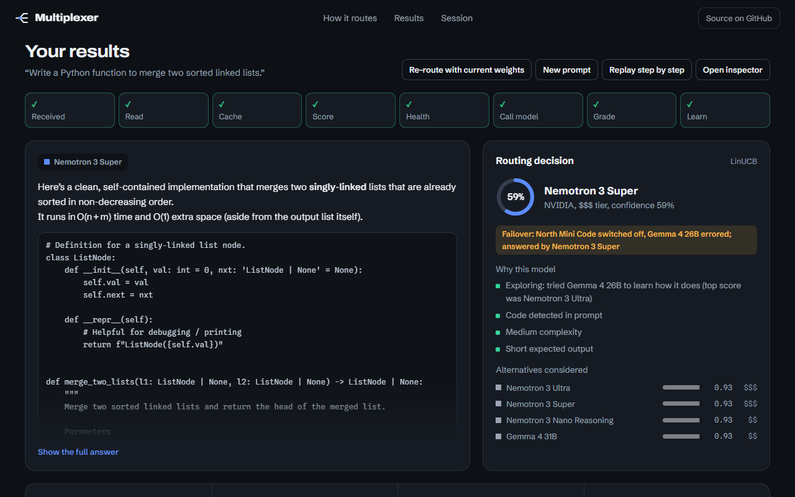
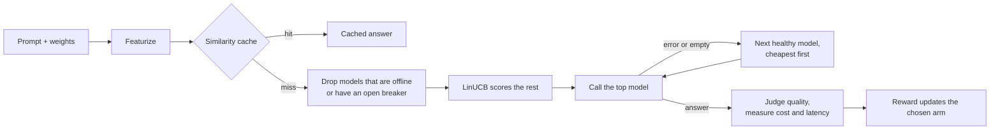
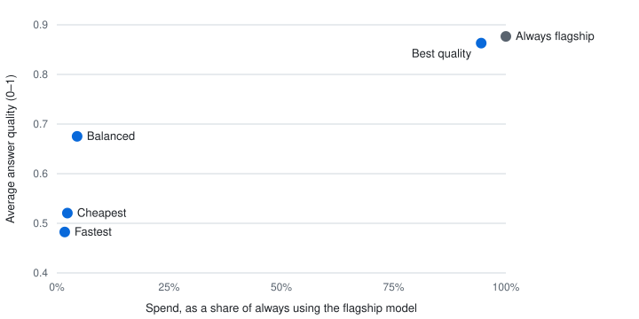
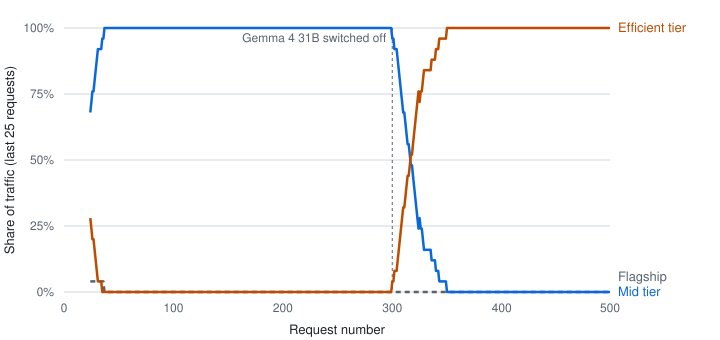

# Multiplexer

Originally developed in June 2026 and published here in August 2026, as part of sharing my past work.

Multiplexer is an LLM gateway that picks a model for every request with a contextual bandit, trading off cost, latency and quality, and shows you each decision it made.

**Live demo:** [multiplexer-routes.vercel.app](https://multiplexer-routes.vercel.app)

> **About the demo.** It routes across 13 free-tier OpenRouter models, so nothing it does costs money. Cost figures use each model's reference list price so that "cheaper" still means something. Without an API key the app runs in simulated mode and labels every answer as simulated.

## See it route a request



<sub>Recorded from a local run with real free-tier model calls. Long waits for the model are shortened.</sub>

| Routing decision | Request inspector | Failover |
|---|---|---|
| [](docs/screenshot-decision.png) | [](docs/screenshot-inspector.png) | [](docs/screenshot-failover.png) |

## The problem

Teams that put LLMs in production usually pick one model for everything. Send every request to the strongest model and you pay flagship prices for "what's 15% of 240?". Send everything to the cheapest and hard questions get weak answers. Hand-written rules ("use the big model when the prompt mentions code") help for a while, then drift as prompts, models and prices change.

Multiplexer treats the choice as a learning problem. It describes each request as a small feature vector, scores every model with a contextual bandit, calls the best one, grades the answer, and feeds the result back so the next similar request is routed with more confidence. You set what matters (quality, cost or speed) and the routing follows.

## How a request is routed



1. **Featurize.** The prompt and your weights become a 9-number context vector.
2. **Cache.** If a past prompt is similar enough, its answer is returned and nothing else runs.
3. **Health check.** Models you switched off, or whose circuit breaker is open, are left out.
4. **Score.** LinUCB scores the remaining models for this context.
5. **Call.** The top model answers. If the call fails or comes back empty, the next healthy model is tried, cheapest first.
6. **Judge.** A judge model grades the answer; cost and latency are measured from the call.
7. **Learn.** The reward updates the arm that was chosen.

## The bandit, precisely

A *multi-armed bandit* repeatedly picks one of several options ("arms") and learns from the payoff. *UCB* (upper confidence bound) picks the arm whose optimistic estimate is highest, so arms with little evidence still get tried. *LinUCB* ([Li et al., 2010](https://arxiv.org/abs/1003.0146)) makes that estimate a linear function of a context vector, so the best arm can differ from request to request.

**Context.** Every request becomes

```
x = [bias, lengthNorm, code, question, reasoning, rare, wQuality, wCost, wLatency]
```

The first six describe the prompt (length, code syntax or intent, question words, reasoning words, rare tokens) and are computed with regular expressions in [`lib/engine.ts`](lib/engine.ts). The last three are your objective weights, normalised to sum to 1. Because the weights are part of the context, each model learns how its payoff depends on what you are optimising for, and moving the sliders changes the decision rather than just re-labelling it.

**Score.** Each model $a$ keeps a ridge regression ($A_a$, initialised to the identity, and $b_a$, initialised to zero). For context $x$:

$$\hat\theta_a = A_a^{-1} b_a \qquad p_a = \hat\theta_a^\top x + \alpha \sqrt{x^\top A_a^{-1} x}$$

The first term is the predicted reward, the second the exploration bonus. Multiplexer uses $\alpha = 0.68$ and picks the highest $p_a$ among healthy models.

**Update.** After observing reward $r$:

$$A_a \leftarrow \gamma A_a + (1-\gamma) I + x x^\top \qquad b_a \leftarrow \gamma b_a + r\,x$$

With $\gamma = 1$ this is textbook LinUCB. Multiplexer uses $\gamma = 0.995$, so old evidence fades slowly and the router can follow drift (a provider that degrades, a changed objective). The $(1-\gamma)I$ term keeps $A_a$ well-conditioned. The maths lives in [`lib/bandit.ts`](lib/bandit.ts).

**Reward.** With weights $w$, judged quality $q$, cost $c$, the flagship's cost for the same tokens $c_f$, and latency $\ell$ in milliseconds:

$$r = \frac{w_q\,q + w_c\,\bigl(1 - \min(1, c/c_f)\bigr) + w_\ell\,\bigl(1 - \min(1, \ell/2600)\bigr)}{w_q + w_c + w_\ell}$$

**Quality signal.** With an API key, `google/gemma-4-26b-a4b-it:free` grades each answer from 0 to 1 against a short rubric ([`lib/judge.ts`](lib/judge.ts)). The judge gets a 5-second budget; if it is slower or fails, a rule-based grader stands in (length, structure, whether requested code is present). Scores are clamped to [0.2, 0.99].

**Starting up.** Each model is tried once before LinUCB takes over, so a fresh deployment spends its first 13 routed requests exploring. In simulated mode the arms are also warm-started on simulated outcomes. With a real key there is no warm start: the router learns only from real traffic.

## Results

These charts come from [`scripts/benchmark.mjs`](scripts/benchmark.mjs). It runs the real routing code (all 13 models, LinUCB, breaker, failover) in simulated mode: model answers, their quality, latency and token counts come from the built-in simulator, so **the numbers are estimates of routing behaviour, not measurements of the real models**. The cache is bypassed so every request is routed.

<picture>
  <source media="(prefers-color-scheme: dark)" srcset="docs/objective-tradeoff-dark.svg">
  
</picture>

<sub>Estimated from 300 simulated requests per objective through the real router (prompt order seed 42, run 2026-10-01). Spend uses reference list prices.</sub>

| Objective | Spend vs always-flagship | Average quality | Average latency |
|---|---|---|---|
| Always flagship (all other models switched off) | 100% | 0.877 | 1820 ms |
| Best quality | 94.5% | 0.863 | 1834 ms |
| Balanced | 4.5% | 0.675 | 1274 ms |
| Cheapest | 2.4% | 0.521 | 928 ms |
| Fastest | 1.8% | 0.482 | 852 ms |

The weights steer the router along a real trade-off. "Best quality" keeps 98% of flagship quality at 95% of the spend; "Balanced" gives up about a quarter of the quality for roughly a twentieth of the spend. No objective beats the flagship on quality, and the router does not pretend to.

<picture>
  <source media="(prefers-color-scheme: dark)" srcset="docs/traffic-over-time-dark.svg">
  
</picture>

<sub>Estimated from 500 simulated requests with the Balanced objective (prompt order seed 42, run 2026-10-01). At request 300 the most-used model was switched off. All three runs (seeds 42, 43 and 44) showed the same pattern, with spend at 4.1–4.7% of always-flagship and no failed requests.</sub>

Two things to notice. With Balanced weights the router converges on a single mid-tier model rather than spreading traffic, which is what a reward-maximising policy should do when one model dominates for this prompt mix. And when that model disappears, traffic moves to the next-best tier with no failed requests.

In the live app, the session panel also shows a measured comparison. On 1 in 10 requests made with a real key, the same prompt is sent to the flagship and to a random model after the user's answer is returned; all three answers are judged and their real cost is recorded. Those tallies are stored in Redis and shown under "Does learning pay off?".

[`eval/route_eval.py`](eval/route_eval.py) is a separate toy: a NumPy LinUCB on 3 made-up models with no latency term and no discount. It illustrates the learning dynamics and is not used for the results above.

## Design decisions and trade-offs

**Semantic cache through Upstash Vector, with a lexical fallback.** Repeated questions shouldn't cost a model call. The cache embeds prompts with OpenAI's `text-embedding-3-small`, hosted by Upstash, and hits when Upstash's similarity score ((1 + cosine) / 2) reaches 0.92. I picked 0.92 from calibration pairs: paraphrases scored 0.926–0.972, and the closest *different* question ("three names for a bakery" against "a coffee shop") scored 0.898. The cost is a network round trip on every request, and the margin between "same question" and "different question" is narrow, so some paraphrases will miss. Without Upstash, or if Vector fails, a 256-dimension character-trigram cache (cosine ≥ 0.86) answers instead; it catches near-duplicates, not paraphrases.

**State in Upstash Redis, as one snapshot.** Serverless instances come and go, so in-memory learning would reset on every cold start. Each request loads a compact snapshot (arms, breaker states, A/B tallies, the offline list) and saves it after the response. The cost is last-write-wins: two requests finishing at the same moment on different instances can drop one update. That's acceptable at demo traffic; per-arm keys with optimistic locking would fix it. Without Redis everything falls back to per-instance memory.

**Free-tier models with reference prices.** A portfolio demo shouldn't need a credit card. The roster in [`lib/models.ts`](lib/models.ts) is 13 `:free` OpenRouter models, and their list prices are kept only as reference values for the cost term. The cost is realism: free models are slower, rate-limited (50 requests a day per key), and sometimes leave the free tier.

**A judge with a time budget.** The reward needs a quality signal, but the user shouldn't wait for it. The judge runs after the answer is in hand, with 5 seconds before the rule-based grader takes over. The cost is a noisier reward when the judge is slow.

**Circuit breaker.** After 3 consecutive failures a model's circuit opens and routing skips it; after 20 seconds one trial request is allowed. This stops the router from hammering a rate-limited provider. The cost is that a provider recovering in under 20 seconds is still skipped.

**Discounted updates.** With $\gamma = 0.995$, evidence from about 200 updates ago carries roughly a third of its original weight. That lets the router follow drift, at the cost of slightly noisier estimates than a non-discounted bandit would have.

**Simulated mode.** Without keys the app still routes, learns, caches and fails over, using a simulator for answers, latency and quality. Every simulated answer is labelled, and with a real key a simulated stand-in (shown only when every provider is rate-limited) is never learned from or cached.

## Run it locally

You need Node.js 20.9 or newer and npm. Python 3 with NumPy and pandas is only needed for the toy eval.

```bash
git clone https://github.com/ManasBorole/Multiplexer.git
cd Multiplexer
npm install
cp .env.example .env.local   # optional: add keys, see below
npm run dev
```

Open http://localhost:3000, type a prompt and press "Route this prompt". With no keys you'll see simulated answers, labelled as such; routing, the cache (lexical), failover and the dashboards all work. Add an `OPENROUTER_API_KEY` for real answers, and the Upstash variables for persistence and the semantic cache. [`.env.example`](.env.example) documents each one.

Checks:

```bash
npm run typecheck
npm run lint
node --experimental-strip-types selfcheck.mts   # bandit maths, key rotation
node verify.mjs                                 # end-to-end report; needs `npm run dev` running
```

Regenerate the results and media:

```bash
node scripts/benchmark.mjs 500 3     # starts its own simulated server; writes docs/data/benchmark.json
node scripts/charts.mjs              # writes the SVG charts in docs/
node scripts/readme-media.mjs        # screenshots + demo GIF; needs Chrome and ffmpeg
pip install -r eval/requirements.txt && python eval/route_eval.py   # the toy eval
```

The benchmark and the media script start their own servers with Upstash switched off, so they never write to shared state.

## API

| Method | Route | What it does |
|---|---|---|
| `POST` | `/api/route` | Routes one prompt. Streams newline-delimited JSON: `token` frames, then a `done` frame with the full decision record and gateway state |
| `GET` | `/api/state` | Gateway state: per-model stats and circuit state, metrics, estimated and measured A/B tallies |
| `GET` | `/api/metrics` | The same metrics in Prometheus text format |
| `POST` | `/api/provider` | Switches a model offline or back online: `{ "modelId": "...", "offline": true }` |

`/api/route` takes `prompt` (required, up to 4000 characters), optional `weights` (`quality`, `cost`, `latency`) and optional `skipCache`. An `x-api-key` header selects a tenant from `MUX_TENANTS`; without one, the public limit of 600 requests a minute applies.

```bash
curl -N -X POST http://localhost:3000/api/route \
  -H "Content-Type: application/json" \
  -d '{"prompt":"Explain the CAP theorem in two sentences.","weights":{"quality":0.5,"cost":0.3,"latency":0.2}}'
```

The last line of the response, from a local run in simulated mode, trimmed:

```json
{
  "type": "done",
  "record": {
    "modelId": "nvidia/nemotron-nano-9b-v2:free",
    "cached": false,
    "similarity": 0,
    "cacheMode": "lexical",
    "costUsd": 0.0000834,
    "baselineUsd": 0.00357,
    "latencyMs": 969,
    "quality": 0.552,
    "reward": 0.695,
    "confidence": 0.59,
    "reasons": ["Low complexity", "Short expected output"],
    "latency": { "featureMs": 0.6, "banditMs": 3.9, "providerMs": 969, "totalMs": 973.5 },
    "candidates": [
      { "modelId": "google/gemma-4-31b-it:free", "score": 0.817, "mean": 0.738, "bonus": 0.079, "chosen": false },
      { "modelId": "nvidia/nemotron-3-nano-30b-a3b:free", "score": 0.792, "mean": 0.713, "bonus": 0.079, "chosen": false }
    ],
    "stages": [
      { "key": "embed", "label": "Cache lookup", "detail": "256-d trigram vector (lexical fallback)", "ms": 0.6, "status": "ok" },
      { "key": "cache", "label": "Similarity cache", "detail": "miss · nearest 0.0%", "ms": 1, "status": "skip" }
    ],
    "simulated": true
  }
}
```

The chosen model here isn't the top score: it was one of the first requests on a fresh server, when every model is tried once.

<details>
<summary>Model roster</summary>

| Model | Provider | Tier | Reference price in / out (USD per 1M tokens) | Latency prior | Quality prior |
|---|---|---|---|---|---|
| Nemotron 3 Ultra | NVIDIA | flagship | 3.00 / 12.00 | 1600 ms | 0.94 |
| Nemotron 3 Super | NVIDIA | mid | 0.80 / 2.50 | 1850 ms | 0.88 |
| Nemotron 3 Nano Reasoning | NVIDIA | mid | 0.30 / 0.90 | 2050 ms | 0.85 |
| Gemma 4 31B | Google | mid | 0.15 / 0.50 | 1050 ms | 0.83 |
| GPT-OSS 20B | OpenAI | mid | 0.20 / 0.60 | 1650 ms | 0.82 |
| Laguna S 2.1 | Poolside | mid | 0.18 / 0.55 | 1200 ms | 0.81 |
| Nemotron 3 Nano 30B | NVIDIA | efficient | 0.20 / 0.60 | 1000 ms | 0.80 |
| Gemma 4 26B | Google | efficient | 0.12 / 0.40 | 950 ms | 0.79 |
| North Mini Code | Cohere | efficient | 0.10 / 0.30 | 900 ms | 0.78 |
| Nemotron Nano 12B | NVIDIA | efficient | 0.10 / 0.35 | 820 ms | 0.76 |
| Nemotron Nano 9B | NVIDIA | efficient | 0.08 / 0.28 | 720 ms | 0.75 |
| Ling 3.0 Flash | inclusionAI | efficient | 0.06 / 0.20 | 700 ms | 0.74 |
| Laguna XS 2.1 | Poolside | efficient | 0.05 / 0.15 | 600 ms | 0.72 |

Latency and quality priors seed the simulator only; with a real key the bandit learns from measured outcomes.

</details>

## Limitations

- **Costs are reference prices.** The free models cost nothing, so savings are computed at list prices, not money actually spent.
- **The benchmark is simulated.** It exercises the real routing code, but answers, quality and latency come from a simulator whose priors I chose. The measured A/B in the live app is real, but it's a small sample.
- **The judge is one free model.** Its grades are noisy and not calibrated against human ratings, and the rule-based fallback is cruder still.
- **Shared state is last-write-wins.** Concurrent requests on different instances can lose an update.
- **The semantic cache costs a round trip** (about a second from India to the US region during testing; less from Vercel's US region), and its threshold sits close to where different questions start to match.
- **Free-tier limits apply.** 50 requests a day per OpenRouter key, frequent provider errors, and models that leave the free tier. When every provider is rate-limited, users get a labelled simulated answer.
- **Featurization is regex-based.** Nine hand-made features are a coarse description of a prompt.

## Roadmap

- Per-arm Redis keys with optimistic locking instead of a whole-state snapshot.
- A seeded simulator so benchmark runs are exactly reproducible.
- Calibrate the judge against a small set of human-graded answers.
- Learned prompt features (an embedding, which the cache already computes) instead of regexes.

## License and author

[MIT](LICENSE). Built by Manas Borole.
